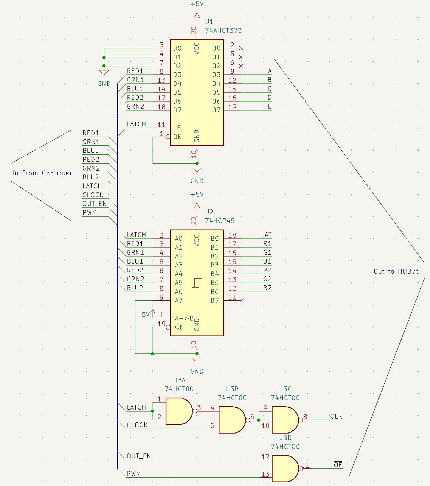

# hub75-framebuffer

[](https://crates.io/crates/hub75-framebuffer)
[](https://docs.rs/hub75-framebuffer)
[](README.md)
[](https://coveralls.io/github/liebman/hub75-framebuffer?branch=main)

DMA-friendly framebuffer implementations for driving HUB75 RGB LED matrix
panels with Rust.  The crate focuses on **performance**, **correct timing**,
and **ergonomic drawing** by integrating tightly with the `embedded-graphics`
ecosystem.

---

## How HUB75 LED panels work (very short recap)

A HUB75 panel behaves like a long daisy-chained shift-register:

1. Color data for *one pair of rows* is shifted in serially on every cycle of `CLK`.
2. After the last pixel of the row pair has been clocked, the controller blanks
   the LEDs (`OE` HIGH), sets the address lines **A–E**, and produces a short
   pulse on `LAT` to latch the freshly-shifted data into the LED drivers.
3. `OE` goes LOW again and the row pair lights up while the next one is already
   being shifted.

Color depth is achieved with **Binary/Bit-Angle Code Modulation (BCM)**:
lower bit-planes are shown for shorter times, higher ones for longer, yielding
2^n intensity levels per channel while keeping peak currents low.

If you want a deeper explanation, have a look inside `src/lib.rs` — the crate
documentation contains an extensive primer.

---

## Framebuffer flavors

The recommended layouts are the **bitplane** framebuffers.  The older
threshold-frame layouts (`plain`, `latched`) are **deprecated** and kept only
for legacy drivers whose DMA can stream a single circular buffer but cannot
raise interrupts.

| Module | Extra hardware | Word size | BCM strategy | Memory use | DMA requirements |
|--------|----------------|-----------|--------------|------------|------------------|
| `bitplane::plain` (`frame`/`row` layouts) | none | 16 bit | true bitplanes | linear in `PLANES` | per-segment repetition (descriptor chain or ISR) |
| `bitplane::latched` (`frame`/`row` layouts) | **external latch gate** (see below) | 8 bit | true bitplanes | linear in `PLANES` | per-segment repetition (descriptor chain or ISR) |
| `plain` *(deprecated)* | none | 16 bit (14 used) | threshold frames | high: `2^BITS − 1` frames | single circular transfer |
| `latched` *(deprecated)* | **external latch gate** (see below) | 8 bit | threshold frames | ×½ of `plain` | single circular transfer |

*Bitplane* framebuffers store one bit-plane per color bit and produce
brightness by streaming each plane a number of times equal to its binary
weight — memory grows linearly with color depth, and the `frame` (plane-major)
and `row` (row-major) layouts let you pick the DMA cadence; see
[Driving the panel](#driving-the-panel-dma-integration).  The deprecated
*threshold* framebuffers instead bake all brightness timing into one
contiguous memory image (`2^BITS − 1` frames), which any circular DMA can
stream but costs exponentially more RAM.

## Multiple Panels

- Use `tiling::RemappedFrameBuffer` to drive several HUB75 panels as one large
  display (the older `TiledFrameBuffer` is deprecated).
- Combine it with a pixel-remapping policy like `ChainTopRightDown` (tiled
  panels) or `QuarterScan` (1/16-scan panels) and any of the framebuffers above.
- The wrapper exposes a single `embedded-graphics` canvas, so a 3 × 3 stack of
  64 × 32 panels simply looks like a 192 × 96 screen while all coordinate translation happens transparently.

### The latch circuit

The *latched* implementations (`bitplane::latched`, and the deprecated
`latched`) assume a small external circuit that holds the row address while
gating the pixel clock.  A typical solution uses a 74xx373 latch along with a
few NAND gates:



The latch IC stores the address bits whilst one NAND gate blocks the `CLK`
signal during the latch interval.  The remaining spare gate can be employed
to combine a global PWM signal with `OE` for fine-grained brightness control
as shown.

---

## Getting started

Add the dependency to your `Cargo.toml`:

```toml
[dependencies]
hub75-framebuffer = "0.12.0"
```

### Choose your parameters

```rust
use hub75_framebuffer::compute_rows;
use hub75_framebuffer::bitplane::plain::DmaFrameBuffer;
// or ::bitplane::latched::DmaFrameBuffer (8-bit bus + latch circuit)

const ROWS:   usize = 32;                 // panel height
const COLS:   usize = 64;                 // panel width
const NROWS:  usize = compute_rows(ROWS); // 16 row pairs
const PLANES: usize = 8;                  // colour depth: 1..=8 bits per channel

// Create a framebuffer (already initialized/cleared)
let mut framebuffer = DmaFrameBuffer::<NROWS, COLS, PLANES>::new();
```

You can now draw using any `embedded-graphics` primitive:

```rust
use embedded_graphics::prelude::*;
use embedded_graphics::primitives::{Circle, Rectangle, PrimitiveStyle};
use hub75_framebuffer::Color;

Rectangle::new(Point::new(0, 0), Size::new(COLS as u32, ROWS as u32))
    .into_styled(PrimitiveStyle::with_fill(Color::BLACK))
    .draw(&mut framebuffer)
    .unwrap();

Circle::new(Point::new(20, 10), 8)
    .into_styled(PrimitiveStyle::with_fill(Color::GREEN))
    .draw(&mut framebuffer)
    .unwrap();
```

Finally, stream the framebuffer to the panel with your MCU's parallel output
peripheral — see [Driving the panel](#driving-the-panel-dma-integration).

---

## Driving the panel (DMA integration)

This crate is **buffer-only**: it builds the memory image and describes exactly
what to stream via the `FrameBuffer` trait — writing the peripheral driver
(the refresh loop) is up to you.  A driver only needs two things from a
framebuffer:

- `FrameBuffer::Word` — the stream element type: `u16` for the `plain`
  variants, `u8` for the `latched` ones.  Your peripheral must output this
  many bits in parallel and generates the pixel clock (`CLK`) itself.
- `FrameBuffer::BCM_SEQUENCE` / `FrameBuffer::bcm_segment(i)` — the ordered
  `(ptr, len, reps)` segments that make up one complete panel refresh.

The framebuffer must live in DMA-capable memory and outlive the transfer:
place it in a `static` (or a DMA RAM section on chips that require one) and
apply whatever alignment and cache maintenance your MCU needs.

### DMA with descriptor chains (least CPU)

The bitplane stream is non-uniform: each segment must be output `reps` times
(the MSB plane up to `2^(PLANES-2)` times).  This maps naturally onto DMA
descriptor chains (e.g. ESP32 GPDMA linked-list mode) — use `BCM_SEQUENCE` /
`bcm_rep_count()` to size the descriptor table at compile time and
`bcm_segment(i)` to populate it; a segment whose `len` exceeds your DMA's
maximum transfer size is simply split across several descriptors.  The
`bitplane::*` module docs show the exact descriptor pattern per layout.  Link
the chain into a loop and the panel refreshes forever with zero CPU
involvement.  For free-running loops, consider the `tail-closes-latch`
feature so `LAT` is not left asserted when the chain wraps around.

### Simple DMA (registers only, no descriptors)

If your DMA is just *source address + length* registers with a
transfer-complete interrupt, walk the segments in the ISR: program the
address and length registers from `framebuffer.bcm_segment(i)`, re-arm the
transfer, and re-issue the same segment until its `reps` count is exhausted:

```rust
use hub75_framebuffer::FrameBuffer;

// One tick of the refresh loop, called from the DMA transfer-complete ISR.
fn reload_dma<FB: FrameBuffer>(fb: &FB, seg: &mut usize, rep: &mut usize) {
    let s = fb.bcm_segment(*seg);
    *rep += 1;
    if *rep >= s.reps {
        *rep = 0;
        *seg = (*seg + 1) % fb.bcm_segment_count();
    }
    // program DMA: source = s.ptr, length = s.len,
    // word size = FB::Word, then start the transfer
}
```

The cadence is modest — the plane-major (`frame`) layouts raise only `PLANES`
interrupts per panel refresh (8 at full color depth); the row-major (`row`)
layouts raise one per segment of every row (`BCM_SEGMENT_COUNT` per refresh).

If your DMA cannot interrupt at all — truly circular-only hardware — the
deprecated threshold framebuffers (`plain`, `latched`) remain an option:
their entire refresh is one contiguous buffer with all BCM timing baked into
the memory image, at an exponential memory cost.

---

## Crate features

### `esp32-ordering` (required for original ESP32 only)

**Required** when targeting the original ESP32 chip (not ESP32-S3 or other
variants). This feature adjusts byte ordering to accommodate the quirky
requirements of the ESP32's I²S peripheral in 8-bit and 16-bit modes. Other
ESP32 variants (S2, S3, C3, etc.) do **not** need this feature.

```toml
[dependencies]
hub75-framebuffer = { version = "0.12.0", features = ["esp32-ordering"] }
```

### `skip-black-pixels`

Skip drawing black pixels for performance boost in UI applications. When
enabled, calls to `set_pixel()` with `Color::BLACK` return early without
writing to the framebuffer, assuming the framebuffer was already cleared.

### `reverse-row-order`

Store the rows of the framebuffer in reverse scan order so that the DMA
stream renders the last panel row first and row 0 last. The rows are
physically reversed in the buffer (row addresses are written back-to-front
while keeping the deferred address-change timing intact), and `set_pixel()`
transparently maps logical rows to the reversed slots, so drawing code and
coordinates are completely unaffected — only the scan order changes. Works
with all framebuffer layouts (`plain`, `latched`, and all `bitplane::*`
variants) and combines freely with the other features.

```toml
[dependencies]
hub75-framebuffer = { version = "0.12.0", features = ["reverse-row-order"] }
```

### `lead-blank-1/2/4/8/16/32` / `trail-blank-1/2/4/8/16/32`

Control the number of pixel-clock cycles of blanking (`OE` HIGH) inserted around
row-address changes. The lead blank controls how many cycles the output is
blanked *before* the row address is changed, and the trail blank controls
blanking *after* the row address is changed. Together they give the address lines
time to settle and prevent ghosting or "bleeding" artifacts caused by the panel
briefly displaying data on the wrong row during the transition.

| Feature          | Blanking cycles   | Position               |
|------------------|-------------------|------------------------|
| *(none)*         | 1 (0 for latched) | before & after change  |
| `lead-blank-1`   | 1                 | before address change  |
| `lead-blank-2`   | 2                 | before address change  |
| `lead-blank-4`   | 4                 | before address change  |
| `lead-blank-8`   | 8                 | before address change  |
| `lead-blank-16`  | 16                | before address change  |
| `lead-blank-32`  | 32                | before address change  |
| `trail-blank-1`  | 1                 | after address change   |
| `trail-blank-2`  | 2                 | after address change   |
| `trail-blank-4`  | 4                 | after address change   |
| `trail-blank-8`  | 8                 | after address change   |
| `trail-blank-16` | 16                | after address change   |
| `trail-blank-32` | 32                | after address change   |

Higher values reduce ghosting at the cost of slightly less brightness (the LEDs
are on for less time per scan line). Start with the default and increase only if
you observe row-transition artifacts on your particular panel hardware.

```toml
[dependencies]
hub75-framebuffer = { version = "0.12.0", features = ["lead-blank-4", "trail-blank-2"] }
```

**Note:** At most one `lead-blank-*` and one `trail-blank-*` feature may be
enabled at a time. If multiple are enabled for the same edge, compile-time cfg
conflicts will result.

### `inter-row-blank-4/8/16/32`

Insert additional dead clock cycles at the row transition, between the latch
and the address-line change. In plain framebuffers the gap entries hold the
previous row address with `OE` HIGH (blank), deferring the address change to
the first pixel after the gap and giving slow panels more time to finish
blanking before the address lines move. In latched framebuffers the latch
and address change are inseparable in hardware, so the gap simply adds extra
blanked cycles after the address change. Row-major bitplane framebuffers
stream the gap between plane 0 (shifted out before the address change) and
plane 1 (shifted out at/after it); all other framebuffers place it at the
end of each row, between that row's latch and the next row's first pixel.

| Feature              | Gap cycles | RAM cost per row                     |
|----------------------|------------|--------------------------------------|
| *(none)*             | 0          | 0 bytes                              |
| `inter-row-blank-4`  | 4          | 8 bytes (16-bit) / 4 bytes (8-bit)   |
| `inter-row-blank-8`  | 8          | 16 bytes / 8 bytes                   |
| `inter-row-blank-16` | 16         | 32 bytes / 16 bytes                  |
| `inter-row-blank-32` | 32         | 64 bytes / 32 bytes                  |

```toml
[dependencies]
hub75-framebuffer = { version = "0.12.0", features = ["inter-row-blank-8"] }
```

**Note:** At most one `inter-row-blank-*` feature may be enabled at a time.
These are independent of the `lead-blank-*` / `trail-blank-*` features and can
be combined with them.

### `invert-oe`

Invert the polarity of the `OE` (output-enable) signal in the generated
stream.  Useful when the panel or driver hardware (level shifters, glue logic)
inverts `OE`, so the framebuffer data matches what the panel actually receives.

### `tail-closes-latch` (plain framebuffers only)

Append a single extra "tail" word at the end of the DMA data that drives `LAT`
LOW (de-asserted) on the final clock edge.  Without it, the last word of each
row leaves `LAT` asserted after the transfer completes; free-running DMA loops
or peripherals that keep clocking can then re-latch stale data or glitch.
Costs one extra 16-bit word per DMA chunk (one per bit-plane for
`bitplane::plain`).

### `defmt`

Implement the `defmt::Format` trait so framebuffer types can be logged with
the [`defmt`](https://github.com/knurling-rs/defmt) ecosystem.

### `doc-images`

Embed documentation images when building docs on docs.rs. Not needed for
normal usage.

Enable features in your `Cargo.toml`:

```toml
[dependencies]
hub75-framebuffer = { version = "0.12.0", 
                      features = ["esp32-ordering", "skip-black-pixels"] }
```

---

## Running tests

```shell
cargo test
```

All logic including bitfields, address mapping, brightness modulation and
the `embedded-graphics` integration is covered by a comprehensive test-suite
(≈ 300 tests).

---

## License

Licensed under either of

* Apache License, Version 2.0, ([LICENSE-APACHE](LICENSE-APACHE) or
  <http://www.apache.org/licenses/LICENSE-2.0>)
* MIT license ([LICENSE-MIT](LICENSE-MIT) or
  <http://opensource.org/licenses/MIT>)

at your option.
